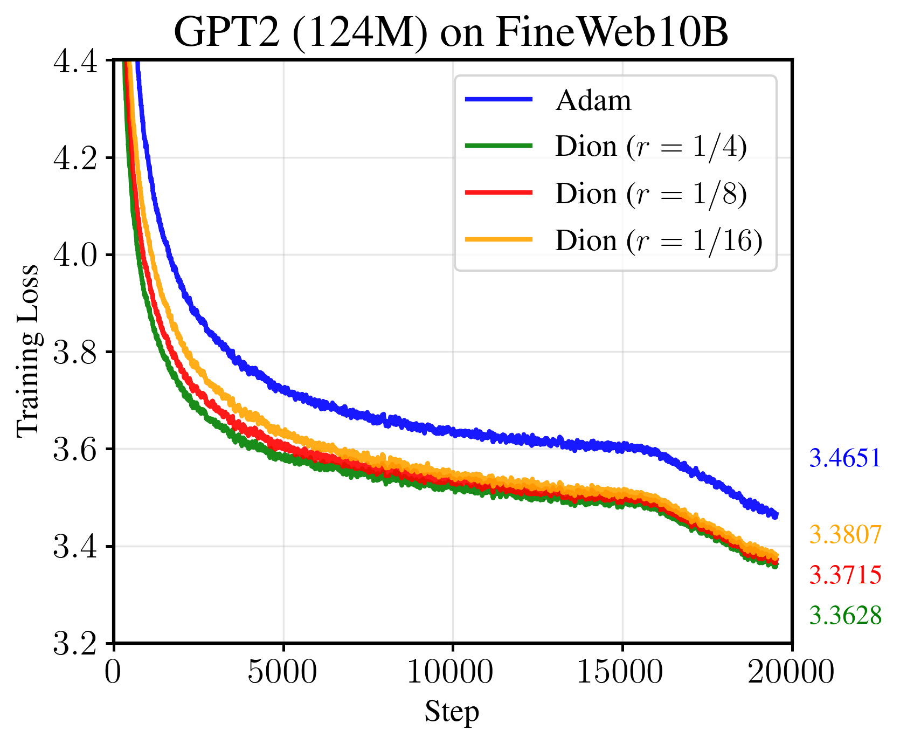

# Megatron-Dion

> **Unofficial project. Not affiliated with or endorsed by NVIDIA.**

Welcome to the **KRAFTON-AI/Megatron-Dion** repository!

This repository provides Dion optimizer implementations built on top of [NVIDIA Megatron-LM](https://github.com/NVIDIA/Megatron-LM).

## Overview

Megatron-Dion is the **Megatron-Core backend implementation** of [Microsoft Dion](https://github.com/microsoft/dion), a communication-efficient distributed optimizer that uses low-rank gradient compression with error feedback.

Key features:
- **Distributed optimizer integration**: Built on Megatron's `--use-distributed-optimizer` infrastructure
- **Low-rank gradient compression** via Randomized Cholesky QR (RCQR)
- **Error feedback** for convergence guarantees
- **Orthogonal parallelism** (FS x TP) integrated with Megatron's parallelism
- **Memory-efficient design** with lazy allocation and buffer reuse

## Supported Parallelism

| Parallelism | Status | Notes |
|-------------|--------|-------|
| Data Parallel (DP) | Supported | Data Parallelism |
| Fully Sharded (FS) | Supported | Dion's core sharding dimension |
| Tensor Parallel (TP) | Supported | Orthogonal TP x FS sharding |
| Pipeline Parallel (PP) | Supported | Including Virtual Pipeline Parallel (VPP) |
| Context Parallel (CP) | Supported | Gradient averaging across CP ranks |
| Sequence Parallel (SP) | Supported | Works with TP |
| Expert Parallel (EP) | Testing | MoE support under validation |

## Important Flags

| Feature | Status | Notes |
|---------|--------|-------|
| `--overlap-grad-reduce` | Supported | Overlapped gradient reduce-scatter |
| `--overlap-param-gather` | Supported | Overlapped parameter all-gather |
| `--use-distributed-optimizer` | Required | Dion requires distributed optimizer |
| `--gradient-accumulation-fusion` | Supported | TransformerEngine GEMM fusion |
| `--bf16` | Supported | BF16 mixed precision training |
| `--fp16` | Supported | FP16 mixed precision training |
| `--no-persist-layer-norm` | Supported | Persistent LayerNorm kernel (enabled by default) |
| `--use-torch-fsdp2` | Not Compatible | Dion has its own FS x TP sharding |
| `--use-megatron-fsdp` | Not Compatible | Dion has its own FS x TP sharding |

## Installation

```bash
# Clone the repository
git clone https://github.com/krafton-ai/Megatron-Dion.git
cd Megatron-Dion
```

Follow the [Megatron-LM installation guide](https://github.com/NVIDIA/Megatron-LM#setup) for dependencies. See `pyproject.toml` for tested environment.

## Quick Start

### Basic Usage

```bash
# 8 GPUs: TP=2, PP=2, FS=2
bash examples/dion/run_fineweb_dion_fs2_tp2_pp2.sh
```

### Key Arguments

```bash
# Dion optimizer selection
--optimizer dion

# Dion hyperparameters
--dion-momentum 0.95          # Error feedback momentum (mu)
--dion-rank-fraction 0.25     # Low-rank ratio r/d (0.0-1.0)
--dion-scalar-optimizer adamw # Optimizer for 1D params

# Data Parallelism
--replicate-model-parallel-size 1    # RP size (usually 1)
--fully-shard-model-parallel-size 2  # FS size
```

### Example Script

```bash
#!/bin/bash
# 8 GPUs = TP(2) x PP(2) x FS(2)

torchrun --nproc_per_node=8 pretrain_gpt.py \
    --optimizer dion \
    --use-distributed-optimizer \
    --tensor-model-parallel-size 2 \
    --pipeline-model-parallel-size 2 \
    --fully-shard-model-parallel-size 2 \
    --dion-momentum 0.95 \
    --dion-rank-fraction 0.25 \
    --overlap-grad-reduce \
    --overlap-param-gather \
    --bf16 \
    ...
```

## Configuration Examples

The example scripts aim to reproduce the training setup from [Microsoft Dion's train.py](https://github.com/microsoft/dion).

### FineWeb Dataset Preprocessing

Convert Microsoft Dion's FineWeb binary format to Megatron indexed dataset format:

```bash
# Download FineWeb data from Microsoft Dion repository
# Then convert to Megatron format:
python tools/convert_dion_to_megatron.py \
    --input-pattern "/path/to/fineweb_train_*.bin" \
    --output-prefix "data/fineweb10B/fineweb_train" \
    --sequence-length 1024
```

### FS=4, TP=2 (8 GPUs)
```bash
bash examples/dion/run_fineweb_dion_fs4_tp2.sh
```

### FS=2, TP=2, PP=2 (8 GPUs) 
```bash
FS_SIZE=2 TP_SIZE=2 PP_SIZE=2 bash examples/dion/run_fineweb_dion_fs2_tp2_pp2.sh
```

### FS=2, TP=2, CP=2 (8 GPUs)
```bash
FS_SIZE=2 TP_SIZE=2 CP_SIZE=2 bash examples/dion/run_fineweb_dion_fs2_tp2_cp2.sh
```

### With Sequence Parallel (SP)
```bash
SEQ_PARALLEL=1 bash examples/dion/run_fineweb_dion_fs2_tp2_pp2.sh
```

### With Virtual Pipeline Parallel (VPP)
```bash
USE_VPP=1 NUM_LAYERS_PER_VPP=3 bash examples/dion/run_fineweb_dion_fs2_tp2_pp2.sh
```

### Example Results



### Verified Integrations

- [NeMo-RL](https://github.com/NVIDIA/NeMo-RL): Verified with [grpo_math_1B_megatron.yaml](https://github.com/NVIDIA/NeMo-RL/blob/main/examples/configs/grpo_math_1B_megatron.yaml) on 8 GPUs

## Architecture

### 2D Data Parallelism (RP x FS)

Dion uses 2D data parallelism where DP (Data Parallel) group is factored into:
- **RP (Replicate Parallel)**: Replicas holding the same parameter shard (gradient all-reduce group)
- **FS (Fully Sharded)**: Shards within the same replica (parameter/gradient sharding group)

```
Data Parallel Group (DP = RP x FS)
+-- Replicate Parallel (RP): Replicas with same shard
+-- Fully Sharded (FS): Shards within same replica

Example: 8 GPUs with TP=2, PP=2, FS=2
- World: [0,1,2,3,4,5,6,7]
- TP groups: [0,1], [2,3], [4,5], [6,7]
- PP groups: [0,2], [1,3], [4,6], [5,7]
- FS groups: [0,4], [1,5], [2,6], [3,7]
```

### Mixed Buckets (Simplified Abstraction)

Dion optimizer handles two types of parameters differently:

- **2D Parameters** (e.g., weight matrices): Use Dion with low-rank compression
- **1D Parameters** (e.g., biases, LayerNorm): Use scalar optimizer (AdamW/Lion)

A **mixed bucket** contains both types of parameters within the same gradient buffer. The optimizer automatically identifies and processes each parameter type accordingly:

```
Bucket Layout:
[---2D weight---|--1D bias--|---2D weight---|--LayerNorm--]
      Dion         AdamW         Dion          AdamW
```

This allows efficient gradient communication while maintaining optimal update rules for each parameter type.

## References

- [Dion: Communication-Efficient Distributed Optimization](https://github.com/microsoft/dion)
- [NVIDIA Megatron-LM](https://github.com/NVIDIA/Megatron-LM)

## License

This project is licensed under the Apache License 2.0.
